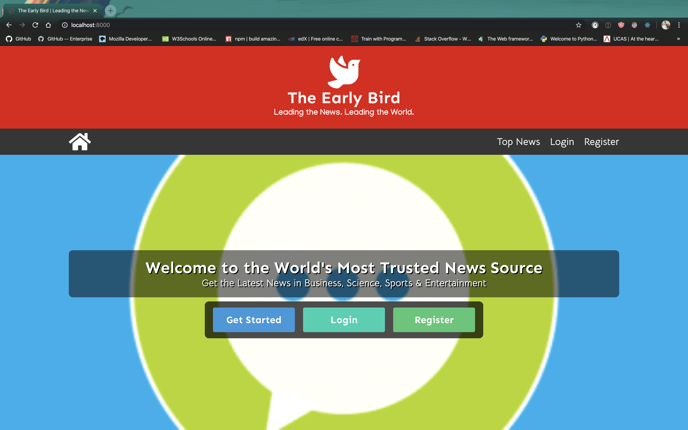
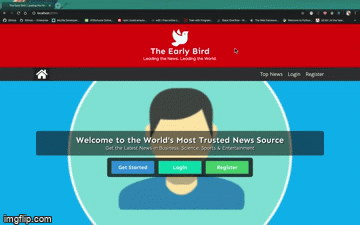
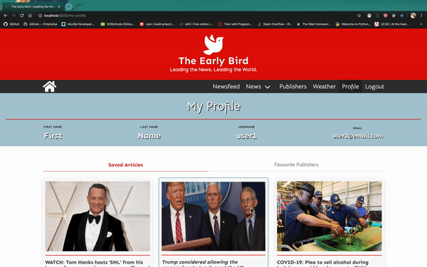
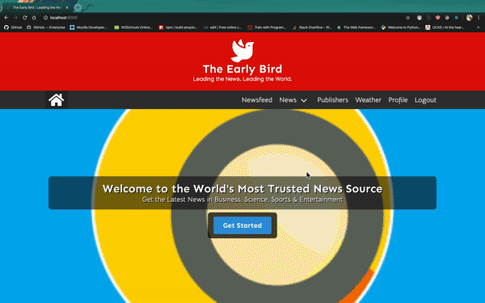

# The Early Bird (Fullstack Django App)
The Early Bird is a news website that provides the latest news and top headlines from a multitude of different sources across 54 countries. This a fullstack web application built with Django, PostgreSQL and ReactJS.

## Getting Started
### Installation
- Clone this repository by running the terminal command `git clone git@github.com:bheki-maenetja/the-early-bird.git`
- In the root folder run the terminal command `pipenv shell`
- In the root folder run the terminal command `pipenv install` to install all necessary packages and modules for the backend
- Navigate to the folder called frontend and run ther terminal command `yarn` to install all necessary packages and modules for the frontend
- To view the site locally run the terminal command `python manage.py runserver` and navigate to localhost:8000 in your web browser

### Deployment
- You can view a deployed version of the site [here](https://the-early-bird.herokuapp.com/)

## Technologies Used
- Python 3
- Django
- PostgreSQL
- ReactJS
- JavaScript (ES6)
- HTML 5
- SCSS/SASS
- Bulma CSS Framework
- Yarn
- Axios
* Third-party APIs
  * [NewsAPI](https://newsapi.org/)
  * [Mapbox](https://www.mapbox.com/)
  * [OpenWeatherAPI](https://openweathermap.org/api)
  * [REST Countries](https://restcountries.eu/)

## Overview
This project is a news site that provides users with the latest news and top headlines from a multitude of different sources across 54 countries around the world. Users can save their favourite news articles and follow their favourite publishers. When logged in, users will have a newsfeed consisting of top stories from their favourite news sources. Additionally, the site also features a weather application where users can get the latest weather conditions for major cities across the world.

<figcaption>Home Page</figcation>


<figcaption>User's can get top news headlines from over 50 Countries</figcaption>


<figcaption>User's can save articles and follow their favourite publishers</figcation>


<figcaption>The Early Bird gets articles from dozens of news sources around the world</figcation>


<figcaption>Keep up to date with the weather forecast with The Early Bird's built-in weather app</figcation>


## Development
This project is a fullstack web application. The backend consists of a PostgreSQL database hosted on a Django server. The frontend was built using React.js and styled with SASS and the Bulma CSS framework. Unlike my previous fullstack projects this project is more 'frontend heavy'. The backend is quite basic, with only one Django app and three models.

### APIs
- This project is powered by several third-party APIs. All news articles and news sources are retrieved with the [NewsAPI](https://newsapi.org/). The weather application is built with [Mapbox](https://www.mapbox.com/) and the [OpenWeatherAPI](https://openweathermap.org/api).
- All news pages use the `top-headlines` endpoint of the [NewsAPI](https://newsapi.org/). This endpoint returns the top 20 news stories for any particular category and/or country.

### Saving Articles
- Given that the news articles are frequently updated, the articles themselves are not stored in a database. Instead, when users 'save' an article an object with selected data from the article is stored in the database and linked to the user.
- Rather than one article having a one-to-many relationship with users, each user will have their own copy of the same article. If a user wishes to remove the article the copy is simply deleted.

```
# Backend functionality for handling articles

class ArticleView(APIView):

  permission_classes = (IsAuthenticated, )

  def get(self, _request):
    articles = SavedArticle.objects.all()
    serialized_articles = ArticleSerializer(articles, many=True)
    return Response(serialized_articles.data, status=HTTP_200_OK)
  
  def post(self, request):
    request.data['user'] = request.user.id
    new_article = ArticleSerializer(data=request.data)

    if new_article.is_valid():
      new_article.save()
      return Response(new_article.data, status=HTTP_201_CREATED)
    return Response(new_article.errors, status=HTTP_422_UNPROCESSABLE_ENTITY)
  
  def delete(self, request):
    try:
      article = SavedArticle.objects.get(pk=request.data['articleId'])
      if article.user.id != request.user.id:
        return Response({'message': 'UNAUTHORIZED!!! GET OUT OF HERE!!!'}, status=HTTP_401_UNAUTHORIZED)
      article.delete()
      return Response(status=HTTP_204_NO_CONTENT)
    except:
      return Response({'message': 'Not found'}, status=HTTP_404_NOT_FOUND)
```

## Reflection
### Challenges
- **Rendering News Articles:** one of the main challenges for the project was finding a way to render article information in a layout that maximised readability for the user. Much experimentation was done with Bulma tiles, columns and boxes.
- **Weather Application:** the most difficult part of the project was the implementation of the weather application. The first hurdle was getting locational data for major cities across the world. Once this data was retrieved a request had to be made for to the [OpenWeatherAPI](https://openweathermap.org/api) to get the latest weather for the city. Instead of making all the weather requests all at once, markers are placed on a map that denote the location of a particular. It is only when these markers are clicked that a request is made to the weather API.

### Room for Improvement
- **Design & Styling:** although there are no layout issues on desktop or tablet devices the site is not yet fully optimized for a mobile experience. This can be fixed with a few media queries and slight adjustments to the layout of articles.
- **Weather App Markers:** markers that denote the location of cities are not positioned where they should be when the app is initially loaded. It's only when the user zooms in on the map that markers slide into place.

## Future Features
- **Weather Forecasts:** at present the weather application only provides information regarding the current weather conditions in a particular location. Weather forecasts would allow users to know what the weather will be like in the next 3 - 5 days.
- **Advanced Newsfeed Settings:** in this version of The Early Bird users can only cofigure their newsfeed by changing the new sources they follow. In the future, this feature will be extened to allow users to configure their newsfeed according to their favourite news categories and countries of interest. 
- **News Notifications:** given that news stories are updated every 15 minutes, this feature would alert users to new developments in their favourite categories of news or countries of interest.
      